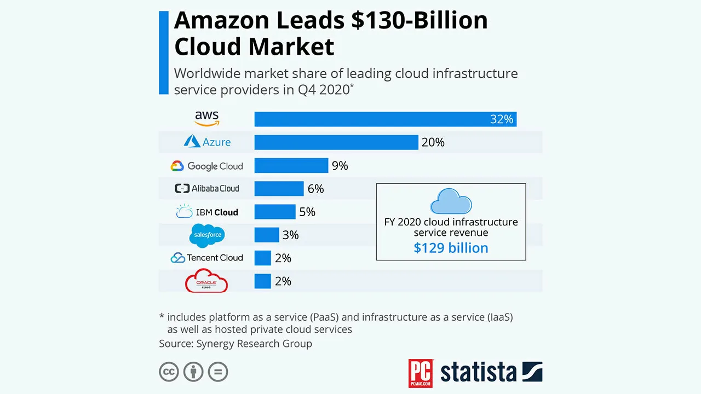
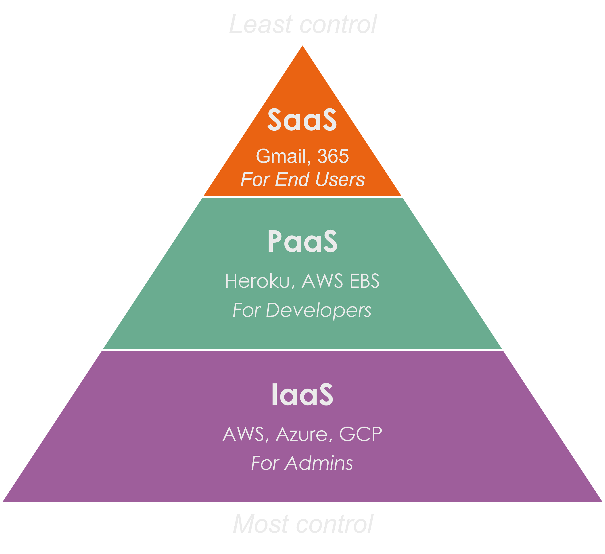

# Cloud Computing using AWS

## Contents of Repository

   1. [AWS EC2 - Instance Setup](https://github.com/bradley-woods/tech230-aws/blob/main/aws-ec2-setup.md)

   2. [AWS EC2 - User Data, AMIs and Launch Templates](https://github.com/bradley-woods/tech230-aws/blob/main/aws-ec2-templates.md)

   3. [AWS EC2 - Two-Tier Architecture Deployment](https://github.com/bradley-woods/tech230-aws/blob/main/aws-ec2-two-tier-deployment.md)

   4. [AWS EC2 - App Deployment Automation](https://github.com/bradley-woods/tech230-aws/blob/main/aws-ec2-automation.md)

   5. [AWS EC2 - Auto Scaling Groups](https://github.com/bradley-woods/tech230-aws/blob/main/aws-ec2-auto-scaling-groups.md)

   6. [AWS S3 - Buckets](https://github.com/bradley-woods/tech230-aws/blob/main/aws-s3-buckets.md)

   7. [AWS VPC - Two-Tier Architecture Deployment](https://github.com/bradley-woods/tech230-aws/blob/main/aws-vpc-two-tier-deployment.md)

   8. [AWS CloudWatch](https://github.com/bradley-woods/tech230-aws/blob/main/aws-cloudwatch.md)

## What is Cloud Computing?

Cloud computing began all the way back in the 1960s where multiple users would simultaneously access a mainframe computer. This idea quickly gained traction and developments were made such as grid computing, utility computing and virtualisation; however, the main idealogy stayed the same.

Nowadays, the term 'cloud computing' refers to on-demand delivery of computing services including computing power, storage and applications over the internet. Rather than storing data and running applications on a local server, which requires maintenance and large upfront costs, users of the cloud can access resources remotely through the internet by renting the infrastructure and platforms from a third-party cloud provider such as AWS.

## Benefits of Cloud Computing

- **Scalability** - The cloud offers the ability to scale resources up or down rapidly allowing businesses to be flexible with demands without heavy investment.

- **Cost** - Cloud computing eliminates upfront investments (CapEx) and maintenance costs due to lack of physical infrastructure to manage. Cloud providers also offer pay-as-you-go to help businesses only pay for what they use (OpEx).

- **Flexibility** - Using the cloud provides users access to software applications and data anywhere in the world, further improving collaboration within remote teams.

- **High availability** - Cloud providers usually have fault-tolerant systems with redundancy options meaning data and applications can be backed up, even if one geographical area was to go down, it can be saved by having the data stored in another area. This helps to keep businesses running and minimise downtime.

- **Security** - Cloud providers employ security measures, update security regularly and offer access and identity controls to protect the infrastructure, data and applications of the businesses that use them.

- **Faster time-to-market** - Using the cloud enables businesses to deploy new applications rapidly, since virtually any size or number of machines can be taken out easily, thus reducing the time-to-market a new product.

## What is AWS?

AWS (Amazon Web Services) was launched by the parent company, Amazon, in 2006 initially offering basic infrastructure services such as Elastic Compute Cloud (EC2) and Simple Storage Service (S3).

AWS is now the leading cloud computing provider with over 200 services including computing power, storage, databases, networking, logging and monitoring, analytics, machine learning etc. AWS is known for its high availability and scalability through its global infrastructure of 99 availability zones spanning across 31 regions.

*(Source: AWS, <https://aws.amazon.com/about-aws/global-infrastructure/?p=ngi&loc=0>)*

## Other Cloud Service Providers

Other large cloud providers include Microsoft Azure, Google Cloud Platform, Alibaba Cloud and IBM Cloud.

*(Source: PCMag.com, 2021)*

There are other cloud providers that may be more suitable for small and medium-sized businesses such as DigitalOcean, OpenStack and IONOS.

## IaaS, PaaS and SaaS

- **IaaS** - Infrastructure as a Service provides access to networking features, computers and data storage. No need to worry about staff, data centers or hardware maintenance, ideal for **system admins**. E.g. AWS, GCP and Azure.

    IaaS is the most flexible and offers the maximum amount of control for a user, where the cloud provider is responsible for maintenance and security of physical hardware, the user is responsible for everything else.

- **PaaS** - Platform as a Service removes the management of infrastructure such as provisioning so you can focus on deployment and management of your applications, ideal for **developers**. E.g Heroku and AWS Elastic Beanstalk.

    PaaS is in the middle where the cloud provider also maintains the OS, middleware and development tools. There is shared responsibility with the user for network, app development and updates.

- **SaaS** - Software as a Service is a complete application that is offered by a provider and fully managed by them, ideal for **users/customers** E.g. Salesforce, Office 365 or Gmail.

    SaaS is the least flexible but easiest to get up and running, less technical knowledge is needed to employ. Cloud provider is responsible for everything to do with the application, the users only need to worry about data input, devices and user access control.

    

## Public, Hybrid and Private Cloud

- **Public cloud** - Public computing where a cloud provider (e.g. AWS or Azure) shares resources to the public as a pay-as-you-go model, with ‘unlimited’ resources/scalability (OpEx). However, there is low visibility and control over workloads.

    **Software** and **gaming** companies as well as the **retail** industry maximise their efficiency using the public cloud and use services not just to run their applications but to gain insights into customers habits through data analytics.

- **Hybrid cloud** - Combination of public and private cloud, private may be used to store important/ private data whereas public can be used for scalability/ availability if private cloud runs out of resources.

    Industries such as **education** and **manufacturing** who are exploring cloud opportunities use hybrid cloud as it allows them to make use of the benefits of both public and private. They also may need to comply with regulations to store sensitive data and protect their intellectual property.

- **Private cloud** - Private computing operated and installed by an organisation with limited scale, may be on-premise or third party (CapEx). The organisation controls all resources and hardware and needs a team to maintain it.

    > **Note:** on-premise is a traditional data center requiring servers, storage and network equipment

    Examples of industries who use the private cloud include **finance** and **healthcare**. This is due to security, privacy and compliance. These industries require private protection, storage and processing of sensitive data that cannot go on the public cloud.

## OpEx vs CapEx

- **OpEx** - Operating expenditure is cost due to services or products over time such as renting cloud services, ongoing licenses or maintenance of hardware.

- **CapEx** - Capital expenditure is a one-time upfront cost such as an investment into a datacentre or some type of initial hardware infrastructure built on premise.

OpEx is preferable since businesses can manage their costs easier and do not have to risk an initial high investment at the start, in case they do not need to use all the resources they have invested in, this cost may be wasted.

Cloud computing is an OpEx because cloud providers allow businesses to pay for what they use on demand by offering a pay-as-you-go model. This ultimately helps businesses to plan and manage costs over time and optimise their infrastructure efficiency and scale as the business needs change.

## Who is using the Cloud?

### 1. Formula 1

Formula 1 is using AWS to migrate its infrastructure from on-premise to the cloud. The main benefit is to provide an improved user experience for fans worldwide through AWS's global reach. Formula 1 is a data-driven sport, and it makes use of AWS's machine learning and data analytics services to improve race metrics such as statistics, predictions and insights into the split-second decisions that the teams and drivers make.

*(Source: AWS, 2018, <https://aws.amazon.com/solutions/case-studies/formula-one/>)*

### 2. Cloud9 eSports

A famous eSports team, Cloud9, is using Microsoft Azure to provide its team a competitive advantage built on Azure's AI and machine learning services and Azure infrastructure to provide the team new insights into the way they play video games.

*(Source: Microsoft, 2022)*

Using Azure has helped the company collaborate with a partner, SOUTHWORKS, who helped developed a Video Review Tool (VRT) for the game: Valorant. This tool uses a data processing pipeline in Azure to run computer vision models against the gameplay footage to generate insights into the player's actions. This requires a massive amount of computing power and dynamic storage which a cloud-based infrastructure is ideal for.

*(Source: Microsoft, 2022, <https://customers.microsoft.com/en-gb/story/1503234231616326987-cloud9-gaming-azure-batch>)*

### 3. SimScale

SimScale is a computer-aided engineering software company that provides a cloud-based SaaS for users to carry out their computationally expensive engineering simulations such as fluid dynamics and finite element analysis. It migrated its entire infrastructure to AWS to provide the computing power required for such intensive simulations carried out by thousands of users in their web browser and to easily scale up and down as the demands change.

*(Source: AWS, <https://aws.amazon.com/solutions/case-studies/simscale/>)*
