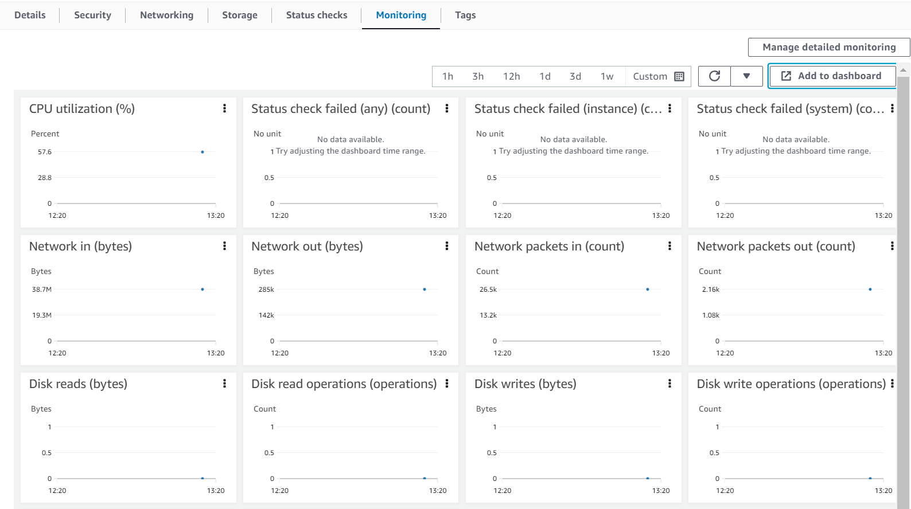
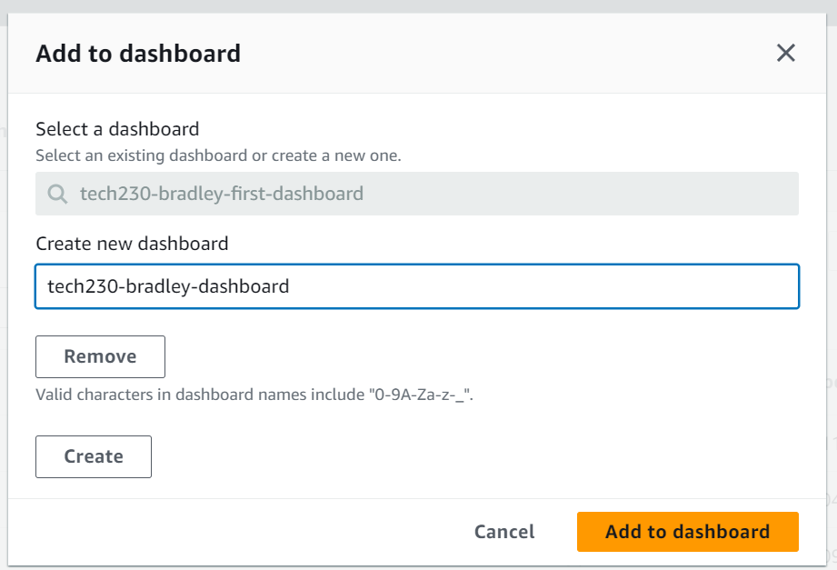
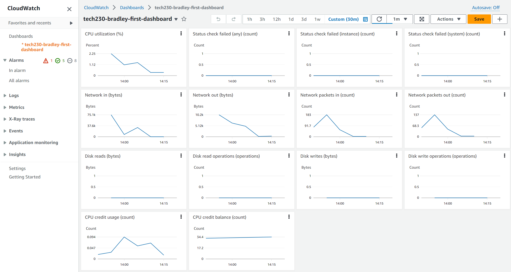
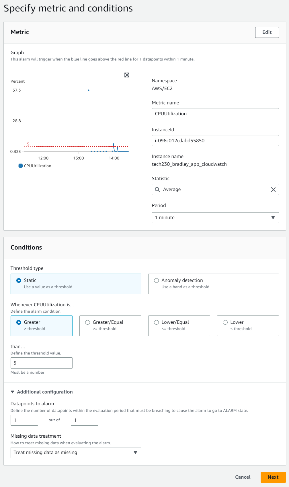
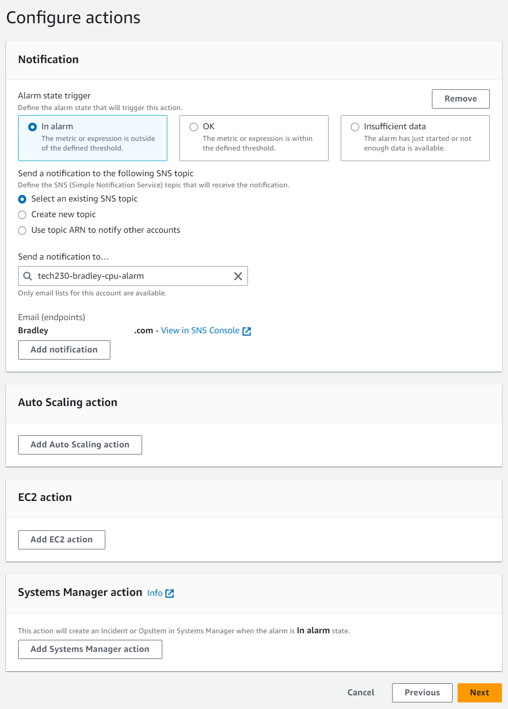
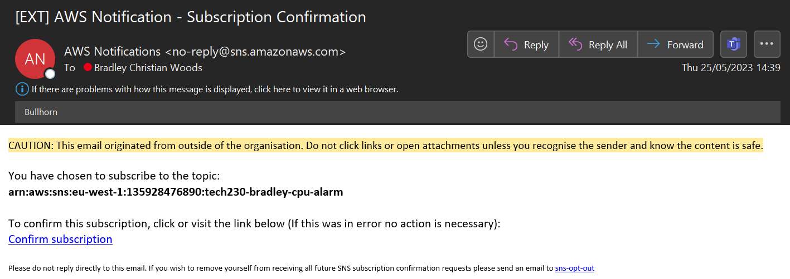
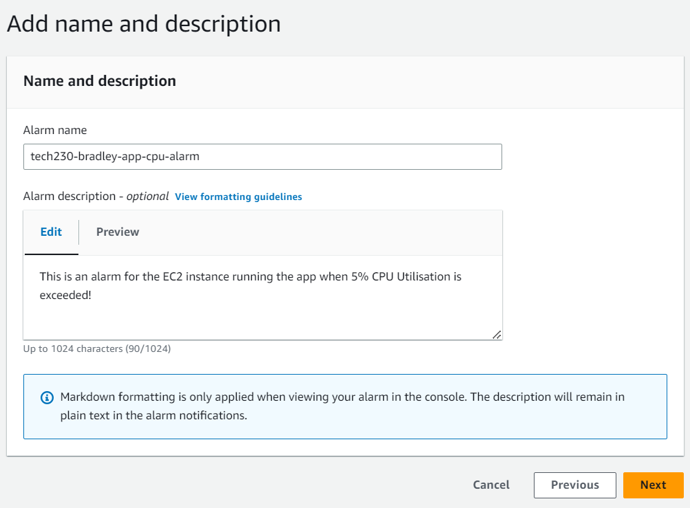
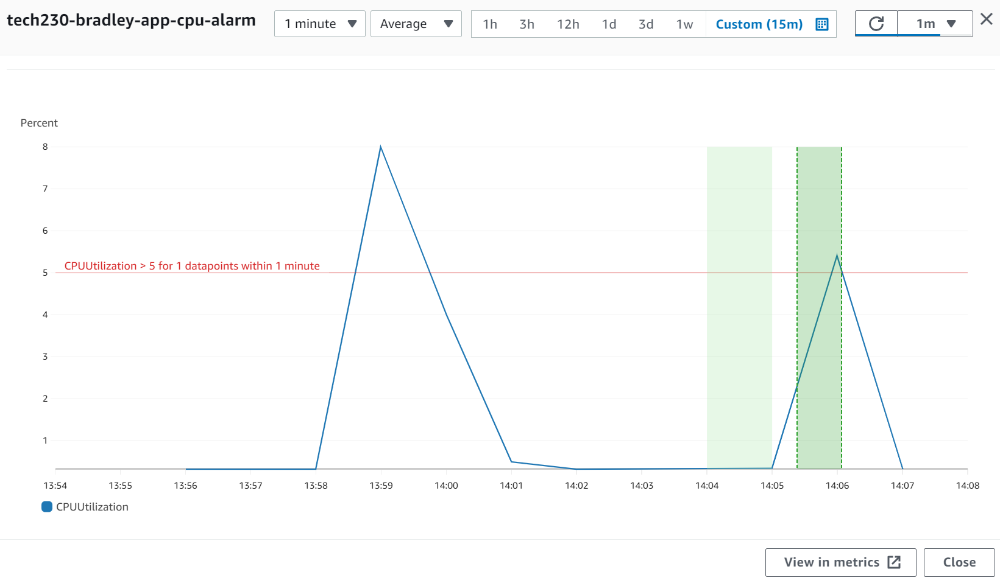
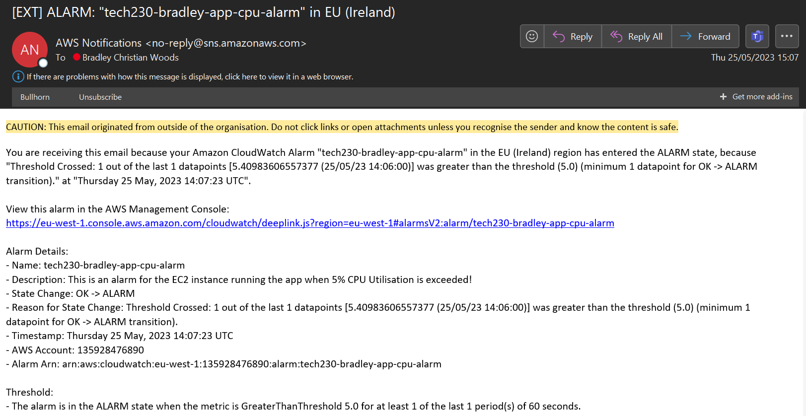

# AWS CloudWatch <!-- omit in toc -->

AWS CloudWatch is used for monitoring and management purposes to provide data and insights into AWS resources. It allows users to monitor and troubleshoot systems and applications within the AWS cloud infrastructure. Metrics and logs can be stored and analysed to improve efficiency of existing resources by connecting them to auto-scaling groups or to set SNS (Simple Notification Service) alarms to help optimise performance and cost of resources.

This guide outlines the following steps to create a CloudWatch dashboard and set alarms for when an EC2 instance exceeds a specific metric:

- [Creating the CloudWatch Dashboard](#creating-the-cloudwatch-dashboard)
- [Creating CloudWatch Alarms](#creating-cloudwatch-alarms)
- [Checking the Alarm Notifications](#checking-the-alarm-notifications)

## Creating the CloudWatch Dashboard

1. The first step is to go to your EC2 instance that you want to monitor and click the 'Monitoring' tab. Then from there you can click 'Manage detailed monitoring' which allows for 1 minute interval monitoring, otherwise click 'Add to dashboard'.

    

2. Next, enter a suitable name for the new dashboard and click 'Create' and 'Add to dashboard' as shown below:

    

3. From here, you can see the overview of the dashboard in CloudWatch and all of the monitoring graphics for different metrics of the instance, as shown below.

    

## Creating CloudWatch Alarms

1. The next step is to create an Alarm for a specific metric, in this case, 'CPU utilization'. From the dashboard, go to the left size bar and select 'Alarms' > 'All alarms'. Then on the next page will be a list of all current alarms, click 'Create alarm' in the top right hand corner.

2. The next step is to specify the metric you want to create the alarm for, in this case it is 'EC2' > 'Per Instance Metrics' > 'CPU Utilization'. We also want to enter the instance ID and the name will come up to confirm the correct instance being monitored. We can leave the 'Statistic' as 'Average' and change the 'Period' down to '1 minute'.

    

    Under 'Conditions, we can leave the 'Threshold type' as 'Static' and select 'Whenever CPU Utilization is **Greater** than **5**'. This tells the alarm to go off when the CPU Utilization exceeds 5% average. We can then leave the rest of the settings as default for '1 out of 1 data point to alarm' and 'Treat missing data as missing'.

3. Next, we can configure the actions of what will happen once this alarm goes off. We want to select 'In alarm' so whenever the metric is outside of the 5% threshold it performs an action. We also want to select or create a new topic. In this case, a new topic has been created using an email address.

    

    > **Note:** you can also add other actions here such as for EC2, you can shut down or terminate instances.

4. You should receive an email notification from AWS asking to confirm the subscription to the SNS (Simple Notification Service), allowing emails to be sent to the provided email whenever the alarm goes off.

    

5. The next step is to add an appropriate name and optional description of the alarm and then review and create the alarm.

    

## Checking the Alarm Notifications

1. In this example, the instance has been logged into and the package source list has been updated and upgraded to simulate higher than normal CPU usage. If we go back to the CloudWatch dashboard and check our alarm we can see a graph of the CPU utilisation during a certain time period. Here we can see at two points the CPU utilisation exceeded the 5% threshold.

    

2. Therefore, the alarm has been triggered and a CloudWatch alarm notification should be sent to the SNS topic email, an example of the alarm email notification is shown below:  

    
