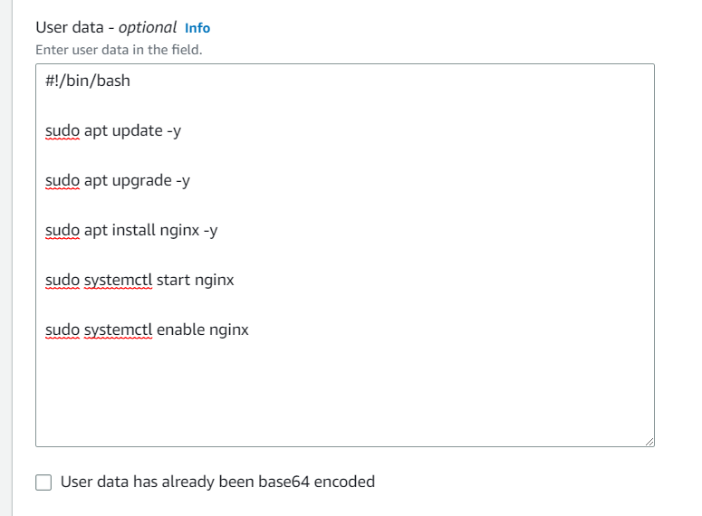
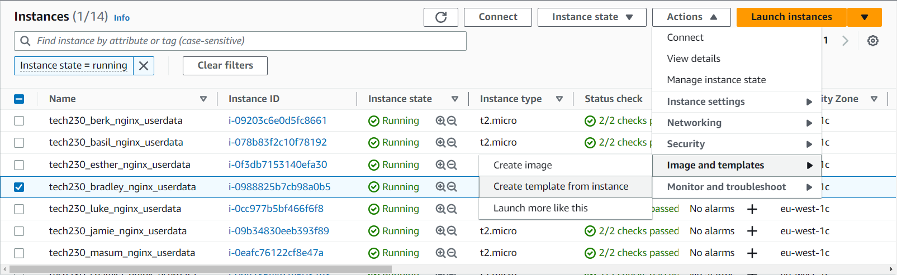
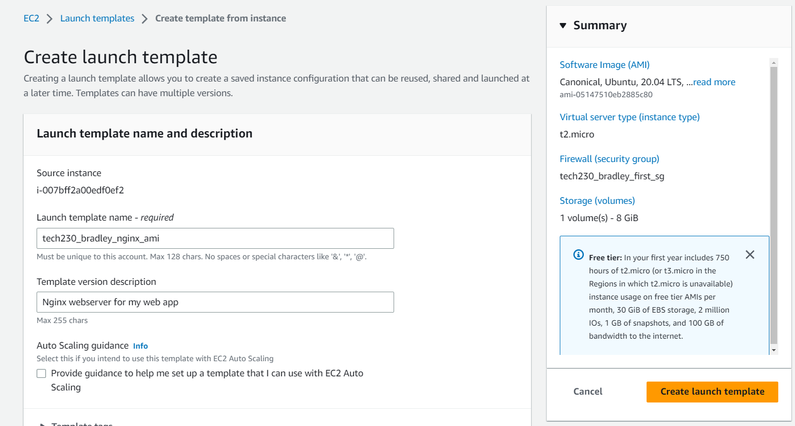
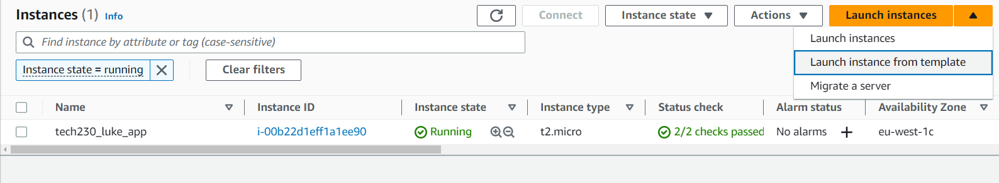
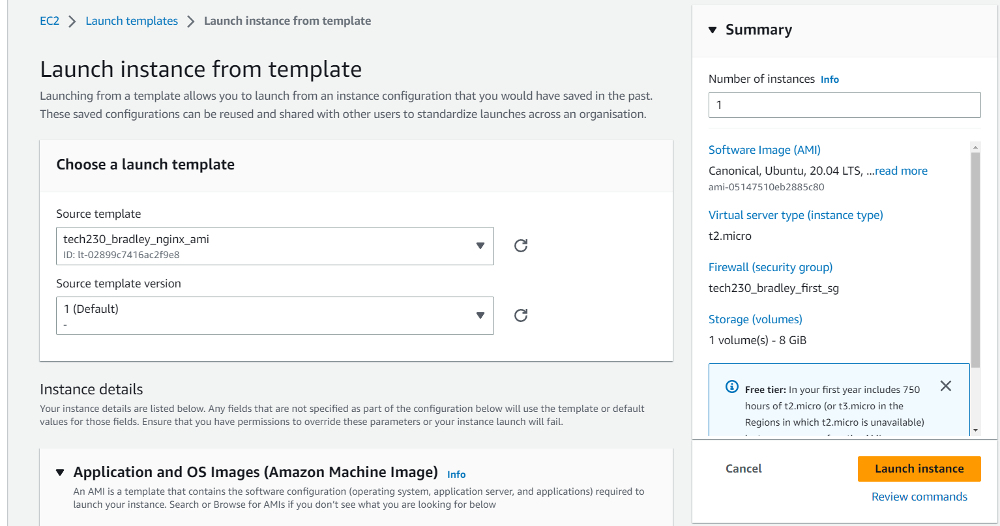
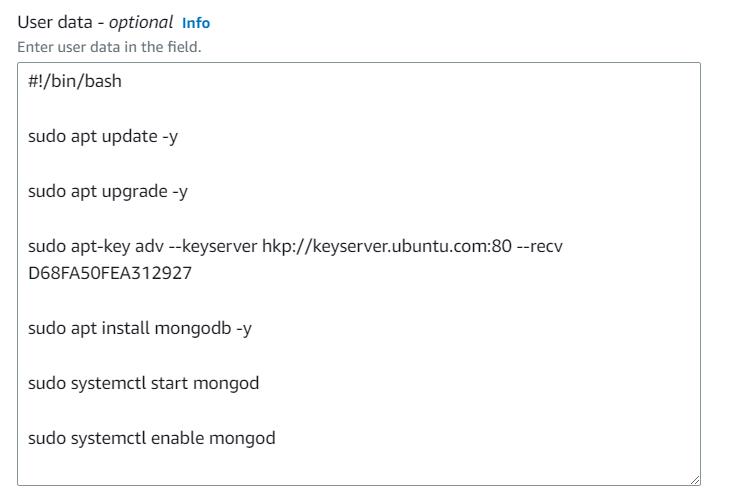
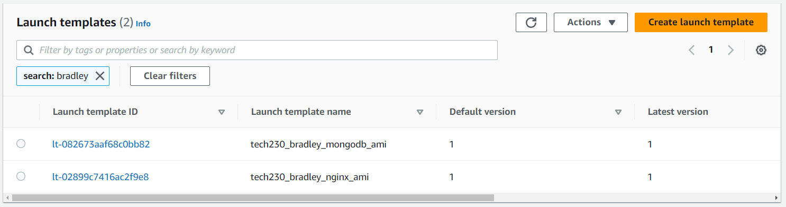

# AWS AMI - Amazon Machine Image

An AMI stores the state of an EC2 instance as a template, so you can make a new EC2 instance or multiple instances using it. For example, if you have deployed a web server on a specific distribution of Linux with all the dependencies etc. you can save it as an AMI, then you can take out a new EC2 instance with that AMI template and it should have the web server up and running.

## Creating an EC2 Instance with User data

1. If we follow the same steps to create an EC2 instance [here](https://github.com/bradley-woods/tech230-aws/blob/main/aws-ec2-setup.md), but at the point where we see 'Advanced details', expand this section and scroll down to 'User data' as shown below. Here, we can have tell the instance to run commands on start-up, similar to a provision script, thus reducing the amount of manual input required for setting up the instance. In this case, installing a web server.

    

    > **Note:** ensure you use `-y` to bypass any warnings or checks that may prohibit the commands.

2. Once everything has been checked and correctly filled out, go ahead and create your EC2 instance.

## Creating a Launch Template from an existing EC2 Instance

1. Once we have created our instance, either through user data or manually, we can highlight it in the list of instances and click the 'Actions' dropdown and select 'Images and templates' > 'Create template from instance'.

    

2. You will now be presented with the following page where you can type in a suitable template name and description, and check your details of the instance before creating the template.

    

## Creating an EC2 Instance from a Launch Template

1. Now that we have our template, we can create an EC2 instance pre-installed and running a web server such as Nginx or a database server such as MongoDB.

2. Firstly, click on the dropdown next to 'Launch instance' > 'Launch instance from template':

    

3. Next, we can choose our template from the dropdown or searching for it. Once again, check all of the details before launching your instance. Also, you can choose multiple of the same instance type by entering the number you require in the 'Number of instances' box under 'Summary'.

    

4. Now you should have an EC2 instance up and running and it should be based on the Launch template, meaning if you have an AMI from a web server, the new instance will also be a web server.

## Additional AMI Launch Templates

1. We have created our first AMI launch template of an Nginx web server in this example, we can also perform the same process to create a MongoDB database server. For example, I can manually create an EC2 instance with the following user data to install and run MongoDB or manually sign into the instance and install MongoDB:

    

2. Following the previous steps, once the instance is created, a new AMI template can be created to easily spin up database servers in the future.

3. To list and view all of you AMI launch templates, you can go to the left sidebar and click on 'Instances' > 'Launch Templates' and search for your templates. You can see my templates for an Nginx web server and MongoDB database server below:

    
