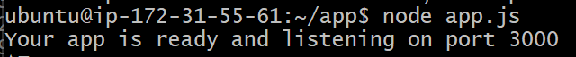
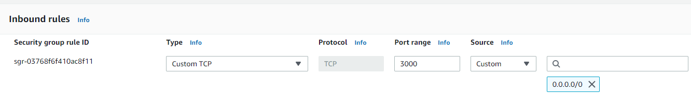

# AWS EC2 App Deployment

In this guide, we will look at deploying our sample web app on an AWS EC2 instance, making it publicly available via the public IPv4 address AWS automatically generates.

Pre-requisites:

- Create and deploy an Nginx web server on an EC2 instance as outlined here: [tech230-aws](https://github.com/bradley-woods/tech230-aws/blob/main/aws-ec2-setup.md)

## Copying a Local file/folder to the EC2 Instance

1. Firstly, to copy the app directory from your local machine to the EC2 instance you can either use `rsync` or `scp` commands. We will use the following `scp` command which stands for **Secure Copy**:

    ```bash
    $ scp -i "~/.ssh/tech230.pem" -r app ubuntu@ec2-34-241-219-62.eu-west-1.compute.amazonaws.com:/home/ubuntu
    ```

    > **Note:** The command first uses the `-i` flag to provide the identity via the key located at `~/.ssh/tech230.pem` and `-r` to copy a directory (not required for copying a file) and then the file/folder you want to copy, in this case it is `app`, then finally the destination which is the address of the EC2 instance and the `/home/ubuntu` directory of it.

2. This may take a long time, but once finished. You should be able to `ls` on the EC2 instance and see you app folder.

## Installing the App

1. Now we can follow the steps performed in deploying our app on a local VM as outlined [here](https://github.com/bradley-woods/tech230-app-deployment). To do this we will be using the following list of commands:

    ```bash
    $ sudo apt update

    $ sudo apt upgrade -y

    $ curl -sL https://deb.nodesource.com/setup_12.x | sudo -E bash -

    $ sudo apt install nodejs -y

    $ sudo npm install pm2 -g
    ```

    > **Note:** if you struggle using the `npm` command you may also need to install npm using the command: `sudo apt install npm`

2. Next, `cd` to the app folder and use the following command:

    ```bash
    app$ npm install
    ```

## Running the App

1. Firstly, we can use the following command to run our app listening on port 3000:

    ```bash
    app$ node app.js
    ```

    

    Or use the following command to run it in the background (recommended):

    ```bash
    app$ pm2 start app.js
    ```

2. Now, if we enter our IP address followed by the port number 3000, it will not work. This is because we need to add a new rule to our security group to allow traffic through the port.

    Login to AWS and go to your EC2 instance and edit your security group to add a new 'Inbound rule' of 'Custom TCP' (Transmission Control Protocol) type on port 3000, and for now we can use 0.0.0.0/0 for the 'Source' as shown below:

    

3. Alternatively, we can skip accessing the app on port 3000 by configuring the Nginx web server as a reverse proxy by editing the default configuration file as outlined [here](https://github.com/bradley-woods/tech230-reverse-proxy). This makes the web app available at the root IP address such as: <http://34.241.219.62>.

    

## Creating an AMI Template of the App Server

1. Once we have deployed the app manually on an EC2 instance, we can follow the steps listed [here](https://github.com/bradley-woods/tech230-aws/blob/main/aws-ec2-ami.md) to create an AMI template of it to make it easier to spin up another app server instance in the future.
