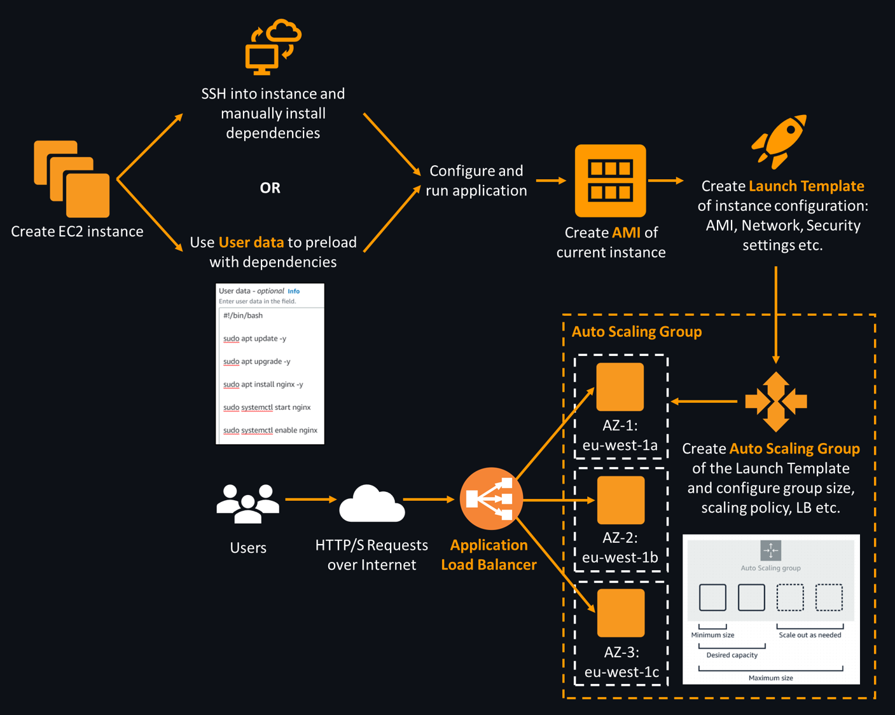

# AWS Auto Scaling Groups

An Auto Scaling Group (ASG) is a group of EC2 instances that are automatically scaled and managed based on a scaling policy, e.g. CPU percentage utilisation. Depending on the minimum and maximum instances you set, the ASG can automatically start up or terminate instances based on the number of requests/ traffic received by the Load Balancer which distributes the requests to each instance. Then, if the CPU percentage goes over the set threshold, the ASG will automatically generate a new EC2 instance.

An ASG has two key benefits: **High Availability** and **Scalability** due to operating in multiple Availability Zones (AZs), it can launch instances in geographically separate datacentres from each other, helping to prevent outages and minimise downtime. This guide outlines how to create an ASG for EC2 instances that run a web server.

Pre-requisites:

- You have created a Launch Template with the necessary settings (AMI, security group etc.) to run an Nginx web server, outlined here: [aws-ec2-templates](https://github.com/bradley-woods/tech230-aws/blob/main/aws-ec2-templates.md)

## Creating the Auto Scaling Group

1. Firstly, navigate to EC2 and on the left side bar go to 'Auto Scaling' > 'Auto Scaling Groups'. Once on this page, any existing ASGs will appear here. Now, click the orange button which says 'Create an Auto Scaling group'.

2. Next, you should now be presented with seven steps to carry out the set up of the ASG. The first step includes filling out an appropriate ASG name and selecting the Launch Template you want the new instances to be started from.

    

3. The second step is to configure launch options, such as selecting the Virtual Private Cloud (VPC) and the multiple AZs in the region you want the instances to be deployed in such as eu-west-1a, eu-west-1b and eu-west-1c, which are the three AZs in Ireland (eu-west-1). This ensures the webapp is highly available.

    

4. The next step is to create an attach a new load balancer to the ASG, we will use 'Application Load Balancer' type and select 'Internet-facing' in this case as there will be traffic through HTTP port 80. We then want to create a new target group for the instances that the traffic will be redirected to, ensuring suitable naming convention is met at all times.

    

5. Continuing down the page, we need to ensure health checks are carried out when the EC2 instances are started up as recommended by AWS.

    

6. The next step is to create the group size for the ASG, in this case we have selected a desired and minimum capacity of 2 instances with the maximum going up to 3 instances. This tells the ASG how many instances it can scale up or down to.

    

7. This step is optional which is to add notifications such as when an instance is started up or terminated.

8. The final step is to add any tags to help identify the ASG easily and also review all of the above set up of the ASG. When the ASG is reviewed, we can go ahead and create our ASG.

    

## Checking the Auto Scaling Group

1. Once the ASG is created, you should see EC2 instances being generated in the instances list. Instead of accessing them through an instances' individual public IP address, we can access the app through the newly created load balancer's DNS record. To do this, go to the left side bar and click 'Load Balancing' > 'Load Balancers', find your Load balancer and copy the 'DNS name' into your address bar and it should show the working web app as shown below:

    
