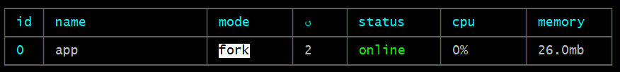
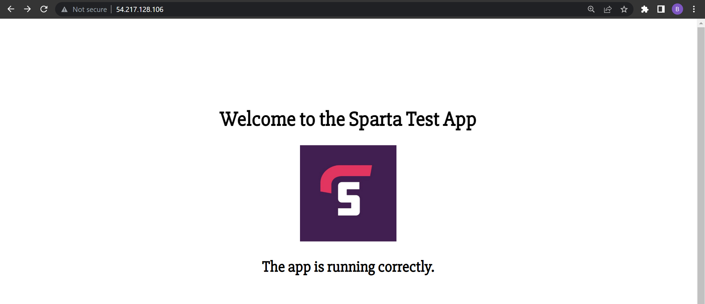

# AWS EC2 App Deployment Automation

This guide outlines how automate all of the previous steps to create a web server running an app and a database server automatically on start-up using two provisioning scripts that can be copied into the 'User data' section in 'Advanced details' when creating an EC2 instance. The provisioning script for the web server should look similar to the file [here](https://github.com/bradley-woods/tech230-aws/blob/main/provision-app.sh) which automates the deployment of the sample app and the script to automate the database server can be found [here](https://github.com/bradley-woods/tech230-aws/blob/main/provision-db.sh).

## Creating the Database Provisioning Script

1. Firstly, create a shell script file (e.g. provision-db.sh) and enter the following line at the beginning. `#!/bin/bash` is called a Shebang and tells the shell that this script should be run using the bash (Bourne Again Shell) interpreter:

    ```bash
    #!/bin/bash
    ```

2. Secondly, the bash shell should update the list of packages and install (upgrade) them (using `-y` to bypass any warnings or user prompts):

    ```bash
    sudo apt-get update -y && sudo apt-get upgrade -y
    ```

    > **Note:** `&&` is treated as a logical AND and is used to run the second command if the first is successful e.g. if the package list managed to update, then install (upgrade) those packages.

3. Next, the script should add the key used to authenticate the MongoDB package to the trusted key set:

    ```bash
    sudo apt-key adv --keyserver hkp://keyserver.ubuntu.com:80 --recv D68FA50FEA312927
    ```

4. The key is then used to download MongoDB Version 3.2 source list from MongoDB's online repository.

    ```bash
    echo "deb https://repo.mongodb.org/apt/ubuntu xenial/mongodb-org/3.2 multiverse" | sudo tee /etc/apt/sources.list.d/mongodb-org-3.2.list
    ```

5. Now we have updated the source list, we can re-update our packages using `update` and install them using `upgrade`:

    ```bash
    sudo apt-get update -y && sudo apt-get upgrade -y
    ```

6. Next, we can now install the correct version of MongoDB (Version 3.2), used to connect to the web application, with the following command:

    ```bash
    sudo apt-get install -y mongodb-org=3.2.20 mongodb-org-server=3.2.20 mongodb-org-shell=3.2.20 mongodb-org-mongos=3.2.20 mongodb-org-tools=3.2.20
    ```

7. We can now use the `sed` (Stream Editor) command to edit files using regular expressions (RegEx) or for simple substitution as in this case, where we want to replace the IP address '127.0.0.1' with '0.0.0.0' so the app can find and connect to the database.

    ```bash
    sudo sed -i "s/127.0.0.1/0.0.0.0/" /etc/mongod.conf
    ```

    > **Note:** the `-i` flag stands for 'in-place' editing which is used to modify the file without the need to save the output of the `sed` command to a temporary file then replacing the original file.

8. Once the 'mongod.conf' configuration file is updated, we need to `restart` and `enable` the MongoDB service as below: 

    ```bash
    sudo systemctl restart mongod && sudo systemctl enable mongod
    ```

9. The next steps would be to copy and paste the provisioning script into the 'User data' section under 'Advanced details' when launching an EC2 instance, so the MongoDB server will be up and running when it has initialised, then in a similar way we can run the app web server.

---

## Creating the Web Server Provisioning Script

1. Firstly, create a shell script file (e.g. provision-app.sh) and enter a shebang at the beginning (`#!/bin/bash`) so Bash can run the script:

    ```bash
    #!/bin/bash
    ```

2. Secondly, the bash shell should update the list of packages and upgrade them (using `-y` to bypass any warnings or user prompts):

    ```bash
    sudo apt-get update -y && sudo apt-get upgrade -y
    ```

3. Now we need to install Nginx using the following command, by default it should be running:

    ```bash
    sudo apt-get install nginx -y
    ```

4. Next, we can edit the default Nginx configuration file to set it up as a reverse proxy which listens on port 80 (HTTP) and passes on requests to the localhost:3000 port when the public IP is requested of the app server. Also, it should pass the requests to localhost:3000/posts when '/posts' is requested. The `sed "s/.../.../" <file-name>` commands are used to replace sections of the file with the correct text. For example, it replaces "s/try_files $uri $uri/ =404;" with "proxy_pass <http://localhost:3000/>;".

    ```bash
    sudo sed -i "s/try_files \$uri \$uri\/ =404;/proxy_pass http:\/\/localhost:3000\/;/" /etc/nginx/sites-available/default

    sudo sed -i "s/# pass PHP scripts to FastCGI server/location \/posts {\n\t\tproxy_pass http:\/\/localhost:3000\/posts;\n\t}/" /etc/nginx/sites-available/default
    ```

5. Then the script restarts the Nginx web server using `restart` since we changed the configuration file, and `enable` tells the process to keep running and automatically start if it is rebooted:

    ```bash
    sudo systemctl restart nginx && sudo systemctl enable nginx
    ```

6. The next step is to ensure the script installs all of the app dependencies, such as NodeJS and Process Manager, as follows:

    ```bash
    curl -sL https://deb.nodesource.com/setup_12.x | sudo -E bash -

    sudo apt-get install nodejs -y

    sudo npm install pm2 -g
    ```

7. The script then adds the `DB_HOST` environment variable to the `.bashrc` configuration file so bash will keep this file persistent so the app can use it to retrieve contents from the MongoDB database:

    ```bash
    echo -e "\nexport DB_HOST=mongodb://192.168.10.150:27017/posts" >> ~/.bashrc

    source .bashrc
    ```

8. Next, the required app folder is downloaded from my GitHub repo through cloning it:

    ```bash
    git clone https://github.com/bradley-woods/app.git
    ```

9. Now we have the app folder, the script `cd` changes directory inside the app folder and installs it using the following commands:

    ```bash
    cd ~/app

    sudo npm install
    ```

10. Assuming the database server is up and running, the script will seed and clear the database:

    ```bash
    node seeds/seed.js
    ```

11. Finally, the app is started and the new environment variable is updated if needed. If the app is already started for a particular reason, the second command restarts it and flushes through the environment variable (idempotent):

    ```bash
    pm2 start app.js --update-env

    pm2 restart app.js --update-env
    ```

12. The app should now be running on the public IP address without needing to add ':3000' port number as the Nginx server has been set up as a reverse proxy:

    

13. The script was run multiple times in the terminal using `./provision-app.sh` ensuring the correct permissions were set, and it still ran smoothly and a running app was produced at the end of it, to ensure the script was idempotent:

    

14. The next steps would be to copy and paste the provisioning script into the 'User data' section under 'Advanced details' when launching an EC2 instance, so the sample app will be up and running when it has initialised.

---

It is important to note that the database server should be up and running and pre-configured before the app server starts up, this is so when the app installs it can connect with the MongoDB database and retrieve the data it needs.
