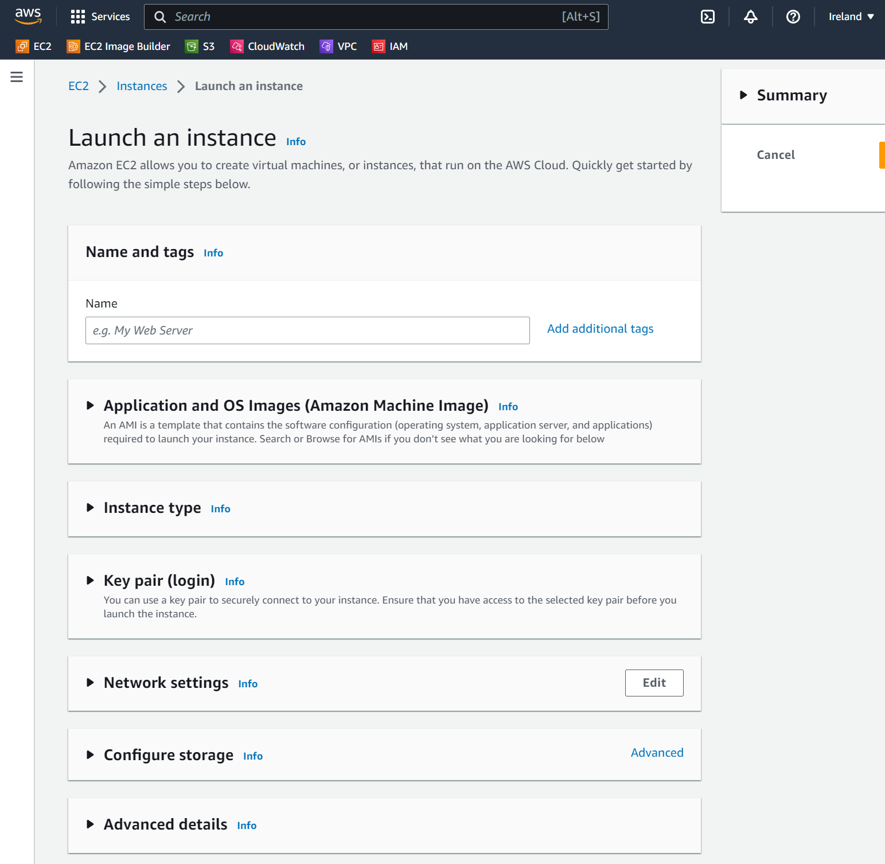
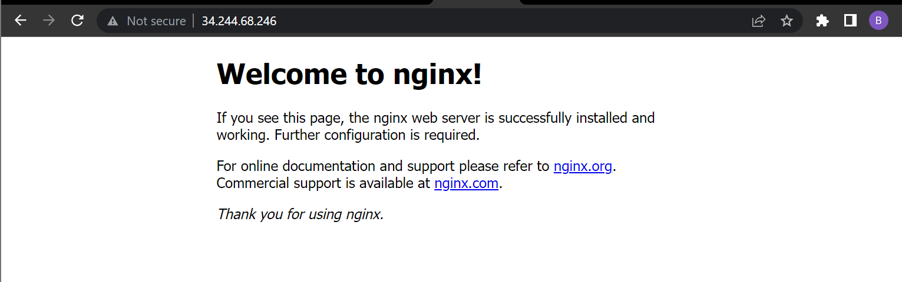

# AWS EC2 Setup <!-- omit from toc -->

In this guide, we will be looking at launching our first VM hosted on the cloud using AWS EC2 (Elastic Compute Cloud) instances which are cloud-based VMs rented from AWS. The following steps outline what will be covered:

- [Launching an EC2 Instance](#launching-an-ec2-instance)
- [Connecting via SSH](#connecting-via-ssh)
- [Setting up an Nginx Web Server on an EC2 Instance](#setting-up-an-nginx-web-server-on-an-ec2-instance)

## Launching an EC2 Instance

1. Firstly, login to your AWS account using your credentials.

2. Ensure you are in correct region by selecting the dropdown next to your username, in this case we will use 'eu-west-1' for Europe (Ireland).

    > **Note:** in AWS, a VM is called an EC2 instance.

3. Go to Services > Compute > EC2 or search for EC2 in the search bar at the top.

4. Now we will use a core AWS service called EC2 to create our first instance. Firstly, click the orange button that says 'Launch instance' as shown below:

    

5. The next page should look like the following image. The next step consists of configuring our EC2 instance with the appropriate details for our use, ensuring we stick to best practices in AWS.

    

   - **Name and tags**

        Name the resource using best practices; group and person name to identify who's it is and what type it is, for example 'tech230_bradley_first_ec2'.

        

   - **Application and OS Images (Amazon Machine Image)**

        Select 'Quick start', choose OS image 'Ubuntu' and select the image 'Ubuntu Server 20.04 LTS (HVM), SSD Volume Type' making sure it is in the **free tier**.

        

   - **Instance type**

        Choose the instance type which outlines the cloud hardware, such as 't2.micro' which provisions the EC2 instance with 1 vCPU and 1 GiB memory.

        

   - **Key pair (login)**

        Choose a key pair to securely connect to the instance through SSH, such as 'tech230'.

        

   - **Network settings**

        Under 'Firewall (security groups)', similar to a firewall we want to create a  security group, clicking 'edit', type in a suitable name such as 'tech230_bradley_first_sg'.

        

        Set the security group's first rule, for type use 'ssh' which is on port 22 and source type of 'Anywhere' just for this demonstration (0.0.0.0). This means, anyone with the key pair can access the instance (two-layer security)

   - **Configure storage**

        We will not be configuring storage, so leave it as 8 GiB.

        

   - **Advanced details**

        Ignore this field for now and create your first EC2 instance!

## Connecting via SSH

When ready, click 'Connect' to connect to the instance. Now, we can connect to the instance using SSH. The key should have been provided for you and located in your .ssh folder, in this case it is 'tech230.pem'.

1. Firstly, go to a bash terminal and make the tech230 key read only for everyone using the following command in the .ssh folder:

    ```bash
    $ chmod 400 tech230.pem
    ```

    > **Note:** 400 gives read-only (-r) rights for the owner of the file in Linux and no permissions for everyone else.

2. Copy the command provided by AWS when you click 'Connect', it should look similar to the following:

    ```bash
    $ ssh -i "tech230.pem" ubuntu@ec2-12-345-67-890.eu-west-1.compute.amazonaws.com
    ```

    > **Note:** -i stands for user identity using the key "tech230.pem" to the user 'ubuntu' at the EC2 IP address on the AWS datacentre location.

    Enter 'yes' to the next prompt which is verifying the authenticity because it is the first time you are entering the key to log in to the EC2 instance on the cloud.

    If all was successful, you should now be logged in to your first EC2 instance!

## Setting up an Nginx Web Server on an EC2 Instance

1. Next, follow the steps outlined previously ([tech230-vagrant-intro](https://github.com/bradley-woods/tech230-vagrant-intro)) to install and run an Nginx web server. In total, the following commands should be entered into the terminal:

    ```bash
    $ sudo apt update

    $ sudo apt upgrade -y

    $ sudo apt install nginx -y

    $ sudo systemctl start nginx

    $ sudo systemctl enable nginx
    
    $ sudo systemctl status nginx
    ```

2. We cannot access the address publicly from HTTP/S because we need to change the security group to add a new rule to allow HTTP/S in addition to SSH.

3. Under your EC2 instance page, go to the 'Security' tab and add a new 'Inbound rule' for HTTP and another one for HTTPS using 0.0.0.0/0 range, as shown below:

    

4. Now we can access it at the public IPv4 address as shown on the 'Instance summary' page, e.g. <http://34.244.68.246/>.

    

5. We can shut down and terminate our instance by going to the dropdown 'Instance state' and selecting 'Terminate instance'. Be warned this will completely destroy the EC2 instance. If you want to just stop the instance instead, select 'Stop instance'.

    
