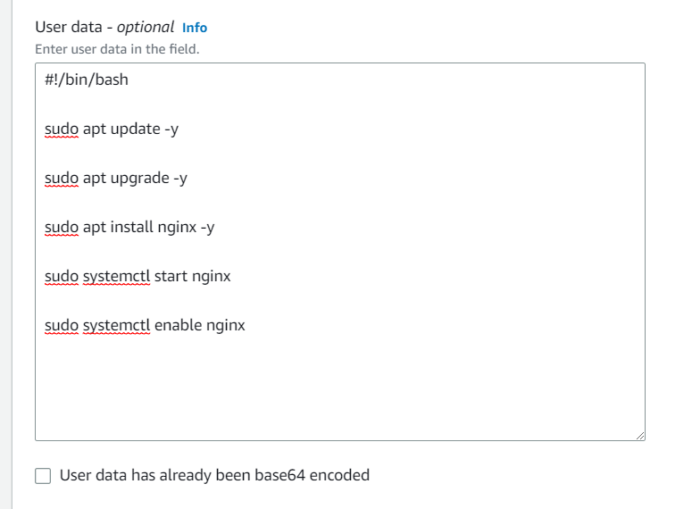
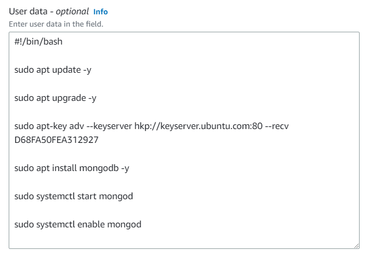
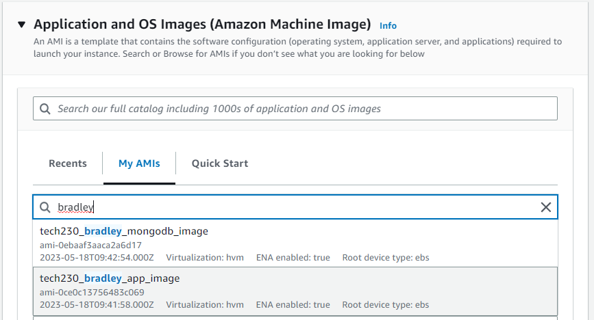
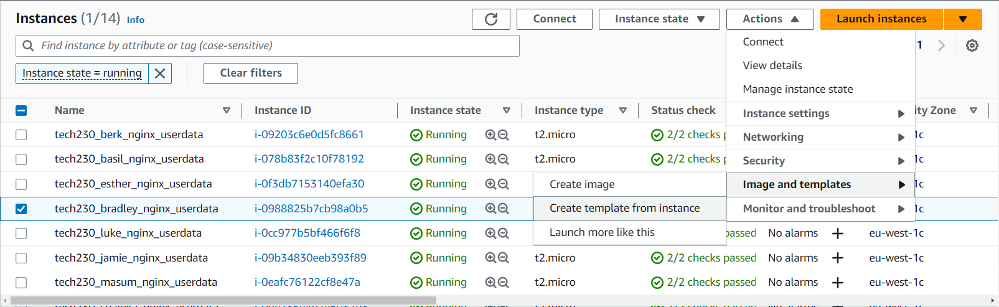
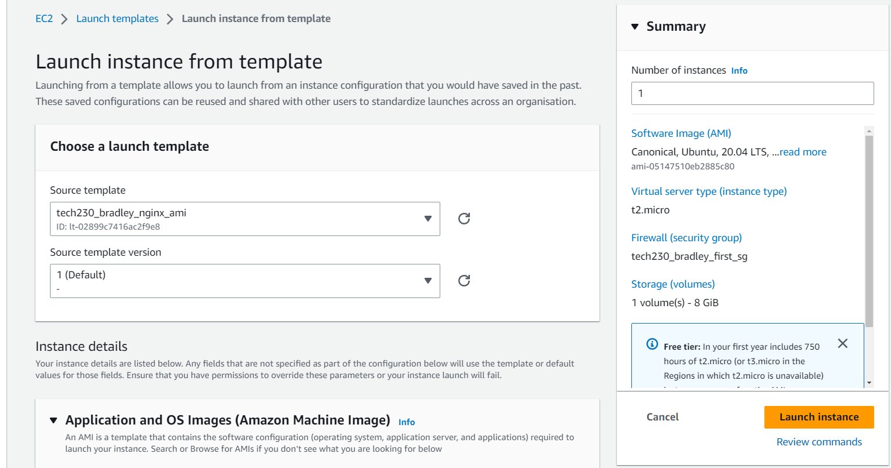

# AWS EC2 - User Data, AMIs and Launch Templates

The following definitions outline the differences between using User Data, AMIs and Launch Templates to improve efficiency when creating EC2 instances:

- **User Data** - When creating an EC2 instance, there is an option in 'Additional details' to add 'User data' which is essentially a provisioning script that is run when the instance starts up for the first time.

    For example, you can have packages and processes already installed when the instance is initialised to help automate the set up of an instance.

- **AMI (Amazon Machine Image)** - An AMI is a snapshot of an existing EC2 instance which stores the state as a template, so you can make a new EC2 instance as a mirror image of a previously created instance containing all the files, packages etc.

    For example, if you have deployed a web server on a specific distribution of Linux with all the dependencies etc. you can save it as an AMI, then you can take out a new EC2 instance with that AMI template and it should have the web server up and running with all the necessary files and dependencies it needs.

- **Launch Template** - A Launch template is a cookie cutter of an EC2 instance used for auto-scaling purposes, it contains all of the setup details including the OS image (or AMI), instance type, key pair, network settings, storage and even user data.

    For example, if you have an AMI of a web server and you want to take out multiple instances of these servers with same setup properties, you can create a launch template which has those specified details and then use it to provision multiple of the same type of server.

---

## Creating an EC2 instance using User Data

1. If we follow the same steps to create an EC2 instance [here](https://github.com/bradley-woods/tech230-aws/blob/main/aws-ec2-setup.md), but at the point where we see 'Advanced details', expand this section and scroll down to 'User data' as shown below. Here, we can have tell the instance to run commands on start-up, similar to a provision script, thus reducing the amount of manual input required for setting up the instance. In this case, installing a web server.

    

    > **Note:** ensure you use `-y` to bypass any warnings or checks that may prohibit the commands.

2. Once everything has been checked and correctly filled out, go ahead and create your web server EC2 instance.

3. We can also perform the same process to create a MongoDB database server using User data to install and run MongoDB:

    

---

## Creating an AMI Template

1. Once we have deployed the app manually on an EC2 instance, we can create an AMI template of it to make it easier to spin up another app server instance in the future. First go to 'Actions' > 'Images and templates' > 'Create image' as follows:

    

2. Next, create an image by filling out a suitable name and description, leaving all other fields as default (add tags if you like):

    

3. Now, when you go to launch a new instance, you can choose your new AMI from 'MyAMIs':

    

---

## Creating a Launch Template from an existing EC2 Instance

1. Once we have created our instance, either through user data or manually, we can highlight it in the list of instances and click the 'Actions' dropdown and select 'Images and templates' > 'Create template from instance'.

    

2. You will now be presented with the following page where you can type in a suitable template name and description, and check your details of the instance before creating the template.

    

## Creating an EC2 Instance from a Launch Template

1. Now that we have our template, we can create an EC2 instance pre-installed and running a web server such as Nginx or a database server such as MongoDB.

2. Firstly, click on the dropdown next to 'Launch instance' > 'Launch instance from template':

    

3. Next, we can choose our template from the dropdown or searching for it. Once again, check all of the details before launching your instance. Also, you can choose multiple of the same instance type by entering the number you require in the 'Number of instances' box under 'Summary'.

    

4. Now you should have an EC2 instance up and running and it should be based on the Launch template, meaning if you have used an AMI from a web server, the new instance will also be a web server.

5. We have created our first Launch template of an Nginx web server in this example, we can also perform the same process to create a MongoDB database server. For example, you can manually create an EC2 instance and install and run MongoDB then following the previous steps, once the instance is created, a new AMI can be created of it to store the state of the machine then a Launch template can be created of it to easily spin up database servers in the future.

6. To list and view all of you Launch templates, you can go to the left sidebar and click on 'Instances' > 'Launch Templates' and search for your templates. You can see my templates for an Nginx web server and MongoDB database server below:

    
