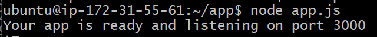
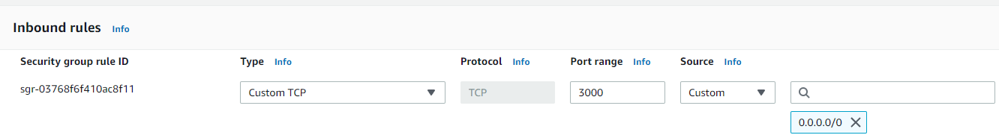
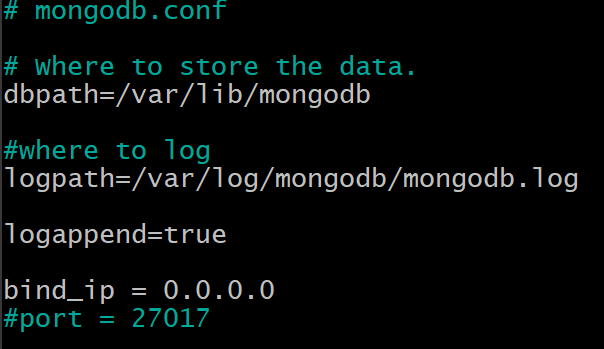
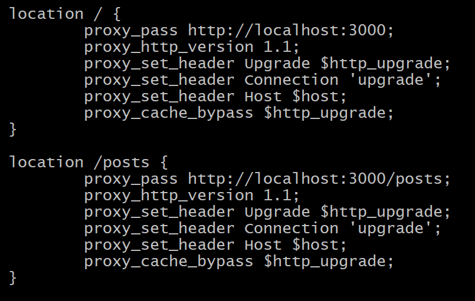
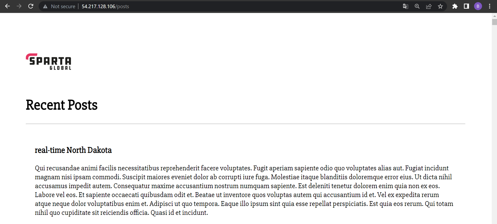
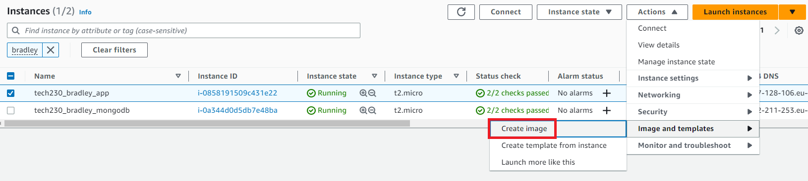
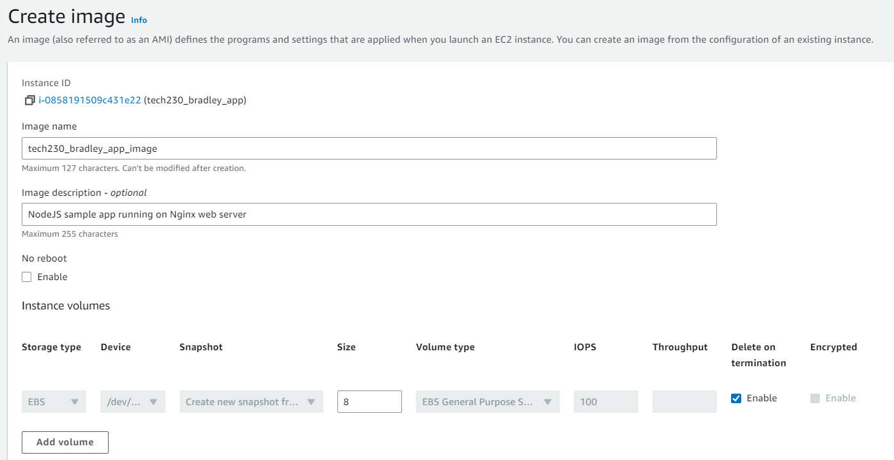
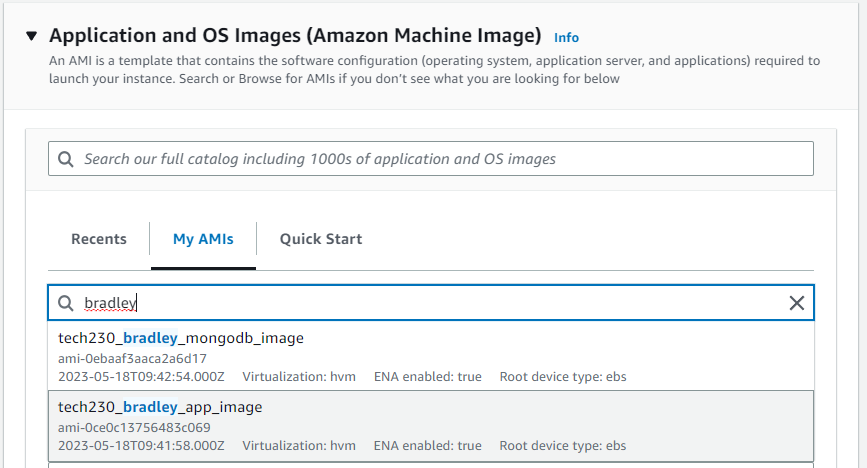

# AWS EC2 - Two-Tier Architecture Deployment <!-- omit from toc -->

In this guide, we will look at deploying our sample web app and database on two AWS EC2 instances, making it publicly available via the public IPv4 address AWS automatically generates. The following key points will be covered throughout this guide:

- [Copying a local file/folder to the EC2 Instance](#copying-a-local-filefolder-to-the-ec2-instance)
- [Installing the App](#installing-the-app)
- [Running the App](#running-the-app)
- [Connecting to the Database Server](#connecting-to-the-database-server)
  - [Configuring the Database Server](#configuring-the-database-server)
  - [Configuring the Web Server](#configuring-the-web-server)
- [Creating an AMI Template of the App and Database Servers](#creating-an-ami-template-of-the-app-and-database-servers)

Pre-requisites:

- Create and deploy an Nginx web server on an EC2 instance as outlined here: [tech230-aws](https://github.com/bradley-woods/tech230-aws/blob/main/aws-ec2-setup.md)

## Copying a local file/folder to the EC2 Instance

1. Firstly, to copy the app directory from your local machine to the EC2 instance you can either use `rsync` or `scp` commands. We will use the following `scp` command which stands for **Secure Copy**:

    ```bash
    $ scp -i "~/.ssh/tech230.pem" -r app ubuntu@ec2-34-241-219-62.eu-west-1.compute.amazonaws.com:/home/ubuntu
    ```

    > **Note:** The command first uses the `-i` flag to provide the identity via the key located at `~/.ssh/tech230.pem` and `-r` to copy a directory (not required for copying a file) and then the file/folder you want to copy, in this case it is `app`, then finally the destination which is the address of the EC2 instance and the `/home/ubuntu` directory of it.

2. This may take a long time, but once finished. You should be able to `ls` on the EC2 instance and see you app folder.

## Installing the App

1. Now we can follow the steps performed in deploying our app on a local VM as outlined [here](https://github.com/bradley-woods/tech230-app-deployment). To do this we will be using the following list of commands:

    ```bash
    $ sudo apt update

    $ sudo apt upgrade -y

    $ curl -sL https://deb.nodesource.com/setup_12.x | sudo -E bash -

    $ sudo apt install nodejs -y

    $ sudo npm install pm2 -g
    ```

    > **Note:** if you struggle using the `npm` command you may also need to install npm using the command: `sudo apt install npm`

2. Next, `cd` to the app folder and use the following command:

    ```bash
    app$ npm install
    ```

## Running the App

1. Firstly, we can use the following command to run our app listening on port 3000:

    ```bash
    app$ node app.js
    ```

    

    Or use the following command to run it in the background (recommended):

    ```bash
    app$ pm2 start app.js
    ```

2. Now, if we enter our IP address followed by the port number 3000, it will not work. This is because we need to add a new rule to our security group to allow traffic through the port.

    Login to AWS and go to your EC2 instance and edit your security group to add a new 'Inbound rule' of 'Custom TCP' (Transmission Control Protocol) type on port 3000, and for now we can use 0.0.0.0/0 for the 'Source' as shown below:

    

3. Alternatively, we can skip accessing the app on port 3000 by configuring the Nginx web server as a reverse proxy by editing the default configuration file as outlined [here](https://github.com/bradley-woods/tech230-reverse-proxy). This makes the web app available at the root IP address such as: <http://34.241.219.62>.

    

## Connecting to the Database Server

Similarly to when we connected the app and database locally using Vagrant, as outlined [here](https://github.com/bradley-woods/tech230-multimachine), we can connect the two cloud-based machines so the app can access the content served by the database server.

Pre-requisites:

- Have your web server up and running the app as per this document.
- Have your database server up and running as per the launch template user data commands: [aws-ec2-ami](https://github.com/bradley-woods/tech230-aws/blob/main/aws-ec2-ami.md)

### Configuring the Database Server

1. Firstly, to configure the database server, login to it using the following SSH command, ensuring you are in the `.ssh` folder:

    ```console
    $ ssh -i "tech230.pem" ubuntu@ec2-52-212-211-253.eu-west-1.compute.amazonaws.com
    ```

2. Next, open and edit the MongoDB configuration file to change the Bind IP address to the private IP of the app server (found on AWS e.g. 172.XX.XX.XX), or in this case we can bind it to 0.0.0.0 to allow any address connect (not recommended):

    ```console
    sudo nano /etc/mongodb.conf
    ```

    

    > **Note:** the default port for MongoDB is 27017 but this can be changed in this configuration file.

3. Lastly, restart the MongoDB service using the following commands:

    ```console
    $ sudo systemctl restart mongodb

    $ sudo systemctl enable mongodb
    ```

### Configuring the Web Server

1. Firstly, to configure the web server; SSH into it, making sure you are in your `.ssh` folder:

    ```console
    $ ssh -i "tech230.pem" ubuntu@ec2-54-217-128-106.eu-west-1.compute.amazonaws.com
    ```

2. Secondly, we want to configure the Nginx web server as a reverse proxy, as the documented [here](https://github.com/bradley-woods/tech230-reverse-proxy), by configuring location blocks to pass traffic to the app server port 3000 and 3000/posts as shown below:

    

3. Next, as per the documentation for connecting multiple local machines outlined here, you need to add the `DB_HOST` environment variable to the `.bashrc` file, using the following commands:

    ```console
    $ echo -e "\nexport DB_HOST=mongodb://<database-ip>:27017/posts" | sudo tee -a .bashrc

    $ source .bashrc
    ```

    > **Note:** remember to use the private IP address of the EC2 instance running the MongoDB database server since the public IP address is dynamic and changes each time it is restarted.

4. Now we can `cd app` into the app folder and restart the app using the following command:

    ```console
    $ pm2 restart app.js --update-env
    ```

    > **Note:** `--update-env` updates the environment variable so `DB_HOST` can be read by the application.

5. The app should now be running and it should be able to access the database server to provide the 'posts' content as shown below:

    

    

## Creating an AMI Template of the App and Database Servers

An AMI (Amazon Machine Image) stores the state (snapshot) of an EC2 instance as a template, so you can make a new EC2 instance or multiple instances using it. For example, if you have deployed a web server on a specific distribution of Linux with all the dependencies etc. you can save it as an AMI, then you can take out a new EC2 instance with that AMI template and it should have the web server up and running with all the necessary files.

1. Once we have deployed the app manually on an EC2 instance, we can create an AMI template of it to make it easier to spin up another app server instance in the future. First go to 'Actions' > 'Images and templates' > 'Create image' as follows:

    

2. Next, create an image by filling out a suitable name and description, leaving all other fields as default (add tags if you like):

    

3. Now, the same previous steps can be carried out to create an AMI image of the database server instance.

4. Finally, when you go to launch a new instance, you can choose your new AMI from 'MyAMIs':

    