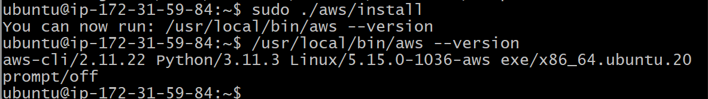
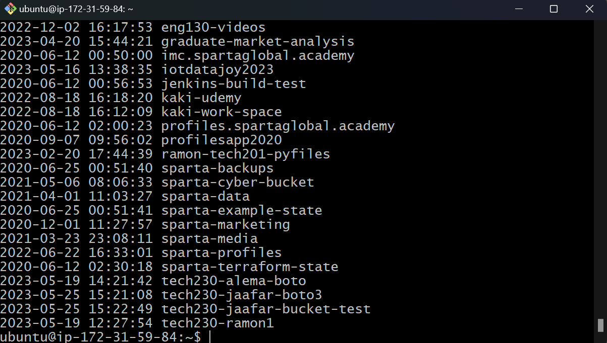
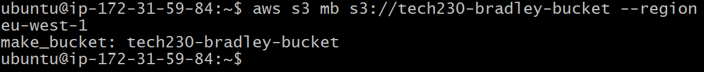
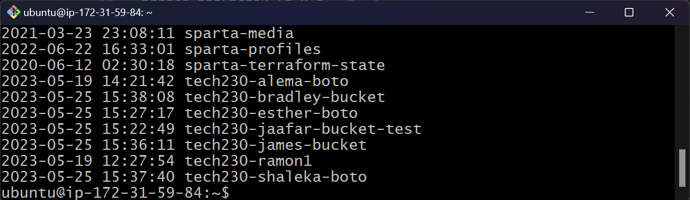
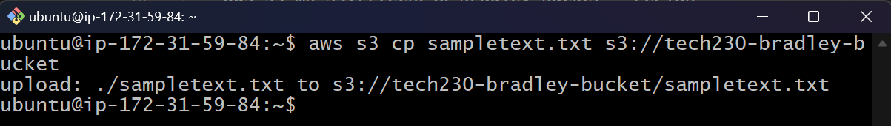
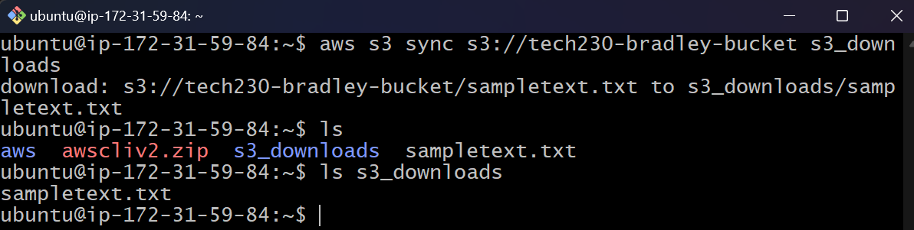
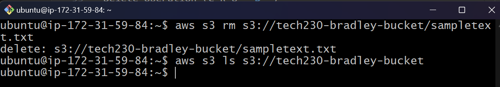
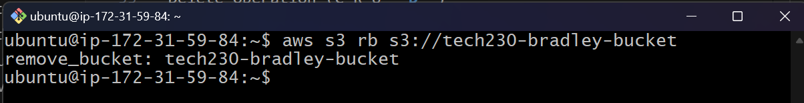
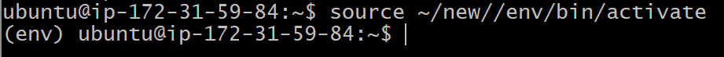
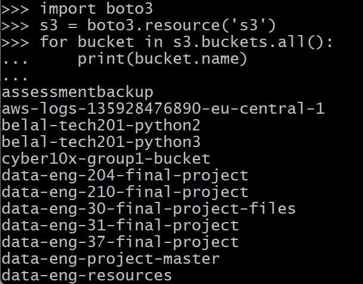

# AWS S3 - Buckets <!-- omit in toc -->

In AWS, there is a storage service called S3 (Simple Storage Service). It enables users to store and retrieve numerous amounts of data at any time or place, with the benefit of AWS's security and durability, find out more detail [here](https://www.simplilearn.com/tutorials/aws-tutorial/aws-s3).

Similar to how we have interacted with EC2, you can use the AWS console which is a web user-interface, to interact with S3. However, it is often easier and faster to use the AWS CLI (Command-line interface) and ultimately automate tasks using the AWS SDK for Python (Boto3).


This guide outlines how to setup and use the AWS CLI and AWS SDK for Python (Boto3) on an EC2 instance to perform CRUD operations on S3, following these steps:

- [Installing AWS CLI on an EC2 Instance](#installing-aws-cli-on-an-ec2-instance)
- [Performing CRUD Operations in S3 using AWS CLI](#performing-crud-operations-in-s3-using-aws-cli)
- [Installing AWS SDK for Python (Boto3) on an EC2 Instance](#installing-aws-sdk-for-python-boto3-on-an-ec2-instance)
- [Automating CRUD Operations in S3 using Python](#automating-crud-operations-in-s3-using-python)

## Installing AWS CLI on an EC2 Instance

1. Firstly, we need to install the AWS CLI with the required dependencies on the EC2 instance, using the following commands:

    ```bash
    $ curl "https://awscli.amazonaws.com/awscli-exe-linux-x86_64.zip" -o "awscliv2.zip"

    $ sudo apt install unzip

    $ unzip awscliv2.zip

    $ sudo ./aws/install
    ```

2. We can check the AWS CLI version using:

    ```bash
    $ /usr/local/bin/aws --version
    ```

    

## Performing CRUD Operations in S3 using AWS CLI

- To install the AWS CLI other than on an EC2 instance you can open up a terminal window or use an IDE (Integrated Developer Environment) and run the following command using the Python installation package manager `pip`:

    ```bash
    pip install awscli
    ```

- To configure your account for the first time you will need a key ID and secret key generated by AWS, this should **NOT** be shared with anyone else. Run the following command, then when prompted, enter your key ID, secret key, default region (e.g. eu-west-1) and default format type (e.g. json):

    ```bash
    aws configure
    ```

- Once configured, to check the list of buckets, use the following command:

    ```bash
    aws s3 ls
    ```

    

Create Operation (**C**-R-U-D)

- To make a new bucket, use the following command. In the example, the bucket is called 'tech230-bradley-bucket' in region 'eu-west-1' (Ireland):

    ```bash
    aws s3 mb s3://tech230-bradley-bucket --region eu-west-1
    ```

    

    

Read and Update Operations (C-**R**-**U**-D)

- To copy a file from your local directory to the S3 bucket:

    ```bash
    aws s3 cp <file-name>  s3://tech230-bradley-bucket
    ```

    

- To download the contents of a bucket to a new local folder, in this case called 's3_downloads', use the command below:

    ```bash
    aws s3 sync s3://tech230-bradley-bucket s3_downloads
    ```

    

Delete Operation (C-R-U-**D**)

- To remove a specific file from a bucket, in this example we removed 'sampletext.txt', use the command:

    ```bash
    aws s3 rm s3://tech230-bradley-bucket/sampletext.txt
    ```

    

- To remove the entire contents of a bucket using `--recursive`, use the command:

    ```bash
    aws s3 rm s3://tech230-bradley-bucket --recursive
    ```

- Only once an S3 bucket is empty it can then be deleted using the command below:

    ```bash
    aws s3 rb s3://tech230-bradley-bucket
    ```

    

---

## Installing AWS SDK for Python (Boto3) on an EC2 Instance

1. Firstly, install the required packages for Python and set up and activate the virtual environment using the following commands:

    ```bash
    $ sudo apt install python3.8-venv

    $ python3 -m venv <env-directory>

    $ source ~/<env-directory>/bin/activate
    ```

    > **Note:** Python should already be installed previously: If it is not installed, use the following command `sudo apt install python3`.

    

2. Next, inside our virtual environment, we can install the required packages for Python Boto3, using the following commands:

    ```bash
    $ sudo apt-get install python3-pip

    $ pip install boto3    
    ```

3. Next, we can run the Python interpreter using the following command:

    ```bash
    $ python3
    ```

## Automating CRUD Operations in S3 using Python

We can automate the above tasks in the CLI using Boto3 which is the AWS SDK for Python.

- If Python is already installed we can just install Boto3 using the below Python installation package manager `pip` command:

    ```console
    pip install boto3
    ```

- We can check the list of buckets similar to previously using the following Python commands, which connects to the S3 resource bucket and loops through each bucket and prints the bucket name:

    ```python
    import boto3

    # Connect to S3 resources
    s3 = boto3.resource("s3")

    # List buckets
    for bucket in s3.buckets.all():
        print(bucket.name)
    ```

    

Create Operation (**C**-R-U-D)

- To create a bucket, we can use the following Python script, which first connects to the S3 client and then creates the bucket:

    ```python
    import boto3

    # Connect to S3 client
    s3 = boto3.client("s3")

    # Create an S3 bucket
    bucket_name = s3.create_bucket(Bucket="tech230-bradley-boto", CreateBucketConfiguration={"LocationConstraint": "eu-west-1"})
    ```

Read and Update Operations (C-**R**-**U**-D)

- To upload to a file to a bucket, we first open and read the contents of the file, then we use `put_object` to add the file (key and body) to the bucket:

    ```python
    import boto3

    # Connect to S3 resources
    s3 = boto3.resource("s3")

    # Open the file we want to send and store it in a variable called data
    data = open("sampletext.txt", "rb")

    # Specify what bucket we are sending the file to
    s3.Bucket("tech230-bradley-boto").put_object(Key="sampletext.txt", Body=data)
    ```

    > **Note:** in the Python open method: `rb` stands for read binary to read the binary format of a file.

- To download from a bucket, we can use the following script, specifying the bucket name, filename from bucket and a new filename to save it as:

    ```python
    import boto3

    # Connect to S3 client
    s3 = boto3.client("s3")

    # Download from S3 bucket with bucket name, filename and download filename
    s3.download_file("tech230-bradley-boto", "sampletext.txt", "sampletext1.txt")
    ```

Delete Operation (C-R-U-**D**)

- To delete a file which is inside an S3 bucket, use the following script, the `s3.Object` to access the file itself:

    ```python
    import boto3

    # Connect to S3 resource
    s3 = boto3.resource("s3")

    # Delete a file in a specific bucket
    s3.Object("tech230-bradley-boto", "sampletext.txt").delete()
    ```

- To delete an empty bucket, use the following command, if we print the `response` we can see if the deletion was successful:

    ```python
    import boto3

    # Connect to S3 resource
    s3 = boto3.resource("s3")

    # Specify what bucket to delete
    bucket = s3.Bucket("tech230-bradley-boto")
    response = bucket.delete()
    ```
