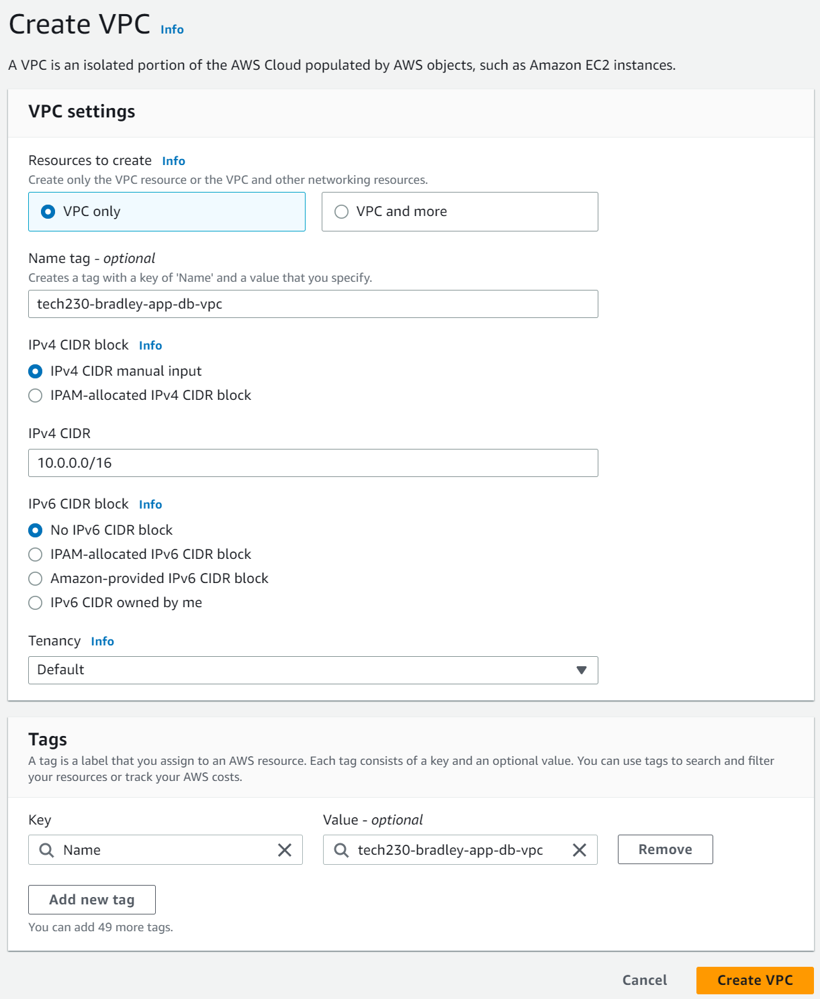
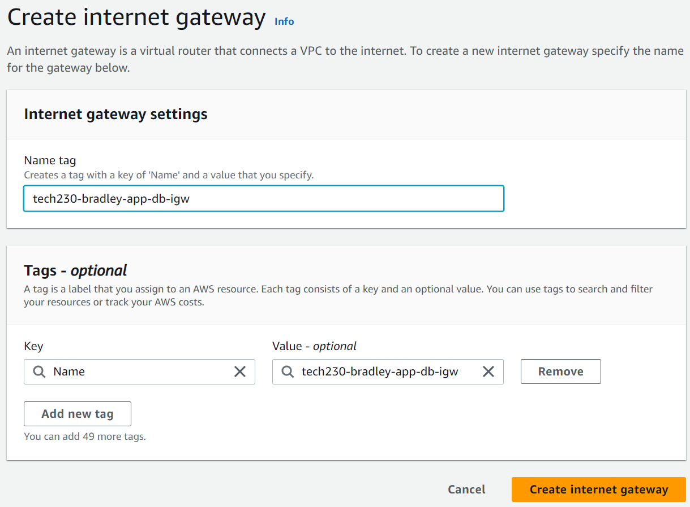
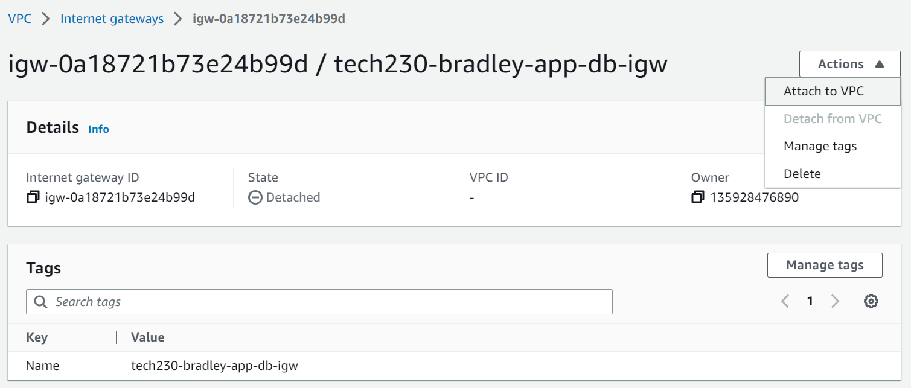
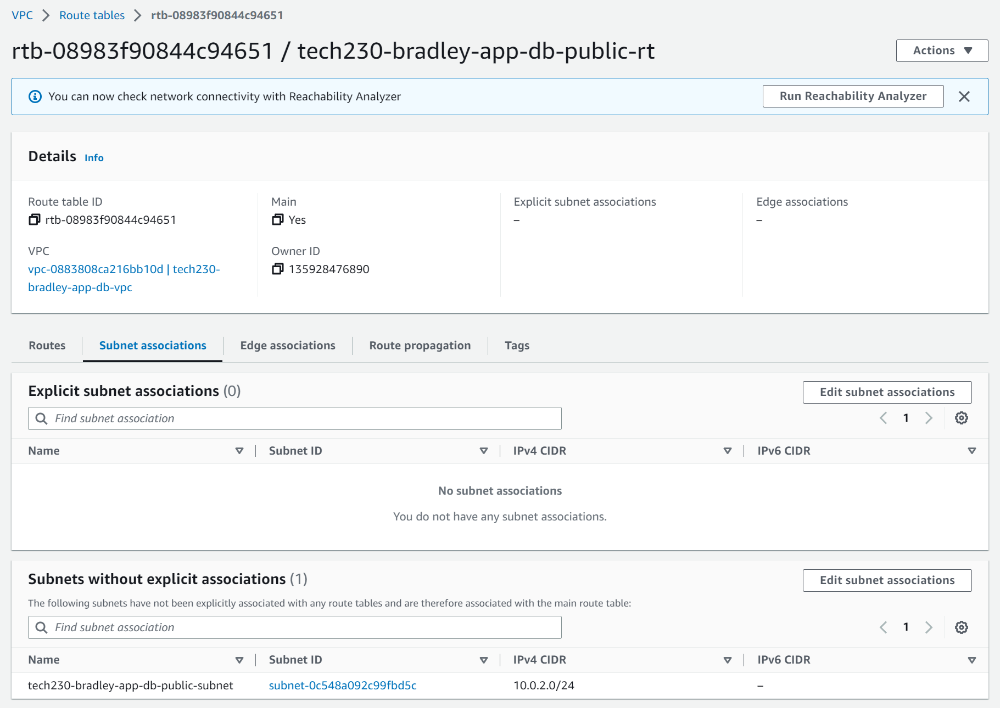
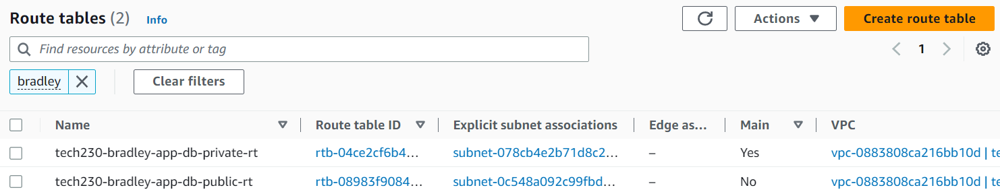
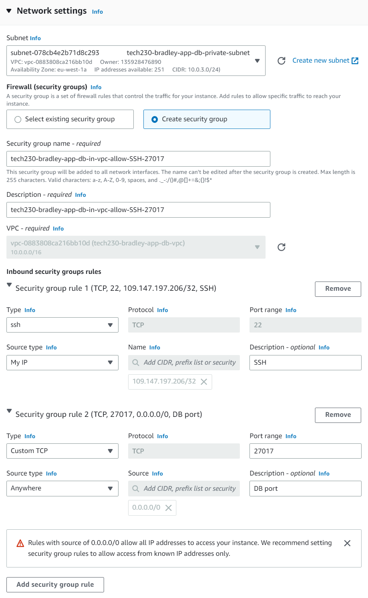

# AWS VPC <!-- omit in toc -->

AWS VPC (Virtual Private Cloud) allows AWS resources to be launched in logically isolated virtual networks which resemble traditional network architecture in a datacentre, with the additional benefits of scalable infrastructure from AWS.

EC2 instances can be placed in a separate subnet in each AZ in a Region, using an internet gateway to allow communication between the resources and the internet, as shown above. The app instance is placed in a public subnet so the public can access it over the internet and it communicates with the database instance in a private subnet.

This guide outlines how to create the VPC shown in the diagram and the necessary networking resources that are involved with deploying two-tier architecture inside the VPC and connecting them to the internet. The following summarises the key points that will be covered in this guide:

- [Creating the VPC](#creating-the-vpc)
- [Creating an Internet Gateway](#creating-an-internet-gateway)
- [Attaching the IGW to the VPC](#attaching-the-igw-to-the-vpc)
- [Creating the Subnets](#creating-the-subnets)
- [Creating the Route Tables](#creating-the-route-tables)
- [Checking the VPC](#checking-the-vpc)
- [Creating EC2 Instances in the VPC](#creating-ec2-instances-in-the-vpc)

## Creating the VPC

1. Firstly, navigate to the AWS VPC service either through the top search bar or by clicking services in the top-left corner. Then, click the orange 'Create VPC' button and the following page should appear:

    

2. For now, we do not want the extra networking resources so we shall select 'VPC only', adding an appropriate 'Name tag' and 'IPv4 CIDR block' (Classless Inter-Domain Routing), in this case we are using a common CIDR: 10.0.0.0/16, which has a subnet mask of 255.255.0.0 and 65,536 (216) IP addresses.

## Creating an Internet Gateway

1. After creating the VPC, the next step is to create the IGW (Internet Gateway). On the left side bar, click 'Internet gateways' then click the orange 'Create internet gateway' button at the top and the following page shall appear:

    

2. All we need to do here is add a suitable name, an example is shown above, and click 'Create internet gateway'.

## Attaching the IGW to the VPC

1. Once the IGW has been created, we need to attach it to the VPC. A green notification at the top should appear and say to attach the IGW to the VPC, or alternatively, you can click 'Actions' > 'Attach to VPC' as shown below:

    

2. On the next screen, shown below, we can search for the VPC we just created to attach our IGW to the VPC. If successful, the 'State' of the IGW should say 'Attached'.

    

## Creating the Subnets

1. The next step is to create the public and private subnets. On the left side menu, go to 'Subnets' and click the orange 'Create subnet' button and you should be presented with the following page:
  
    

2. We can search for our newly created VPC, then write a suitable 'Subnet name' e.g. 'public-subnet' to distinguish the subnet from a private subnet as this is very important to allow privacy of resources within our private subnet. We can then let AWS decide on the AZ the subnet will reside or we can choose one e.g. 'eu-west-1a'. After this, we can enter a suitable 'IPv4 CIDR block', e.g. 10.0.2.0/24 as it belongs on the VPC CIDR block 10.0.0.0/16, and allows up to 255 different IPs (10.0.2.0 to 10.0.2.255).

3. In a similar way, we can then create the private subnet, using an 'IPv4 CIDR block' of 10.0.3.0/24. In this example, we have selected the same AZ, however, it may be beneficial to choose a different AZ to allow for high availability since if the app AZ goes down, the database will still be functional and vice versa.

## Creating the Route Tables

1. The next step is to create a route table for the public subet and set up routes from the networking resources e.g. the IGW to the subnet. To create a route table, click 'Route tables' on the left and click the 'Create route table' orange button and the following screen shall appear:

    

2. Next, fill out a suitable name and select the VPC. Once created, we can go to the 'Subnet associations' tab and see there are 'Subnets without explicit associations' as shown below:

    

3. To associate these subnets with the route table, click 'Edit subnet associations', and the following screen shall appear, here we can simply select our public subnet we created earlier and it shall associate it with this route table.

    

4. Now, we can go to the 'Routes' tab and click 'Edit routes' where we can then 'Add route' to add a new route for the target internet gateway with a destination of 0.0.0.0/0 so any IP address can access it.

    

5. Instead of repeating the steps 1 to 3 for creating the private subnet route table, the VPC should have automatically created a 'main route table' by default, this routes all unassociated subnets internally, ensuring we only have one route for the local target and no connection to the IGW so it is suitable for the private subnet, feel free to rename it as below:

    

## Checking the VPC

1. Finally, we can go back to our VPC on the left side menu and check the 'Resource map' as shown below to ensure the subnets were set up and connected to the correct route table and that the public subnet was connected to the IGW.

    

2. Our VPC is now set up and we are ready to add EC2 instances inside our subnets in the next step.

## Creating EC2 Instances in the VPC

1. To add EC2 instances in the newly created VPC, we can create an instance in the familiar way as outlined [here](https://github.com/bradley-woods/tech230-aws/blob/main/aws-ec2-setup.md). However, when you get to the 'Network settings' section, select the new VPC and, in this example, the private subnet since we are creating a database instance and want to keep this hidden/private to the internet. This means we also have to create a new security group, with the following inbound rules to only allow access via SSH and MongoDB port 27017:

    

    > **Note:** we need to create a new security group (SG) because existing SGs will not be compatible with the new VPC subnets. The security group must be in the same VPC as the instance's subnet.

2. Once created, we can do the same for the web application instance but this time we can set up the 'Network settings' for the public subnet, as shown below, creating a new security group to allow SSH, HTTP and the application port 3000 communication:

    
